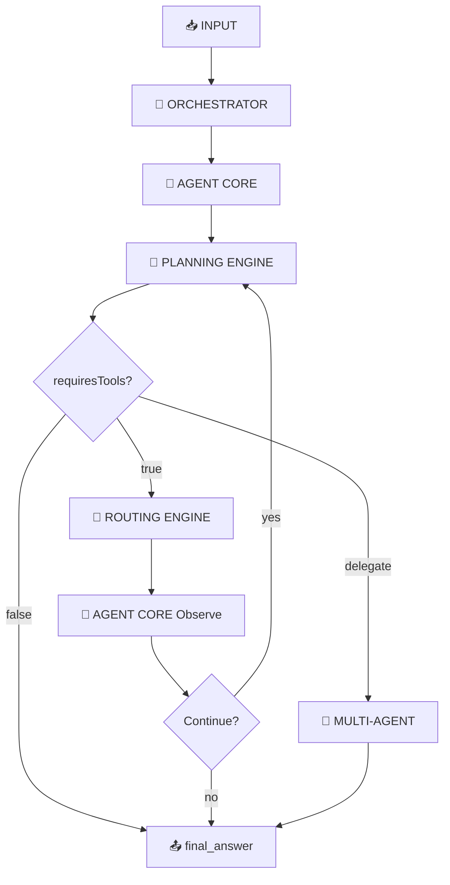
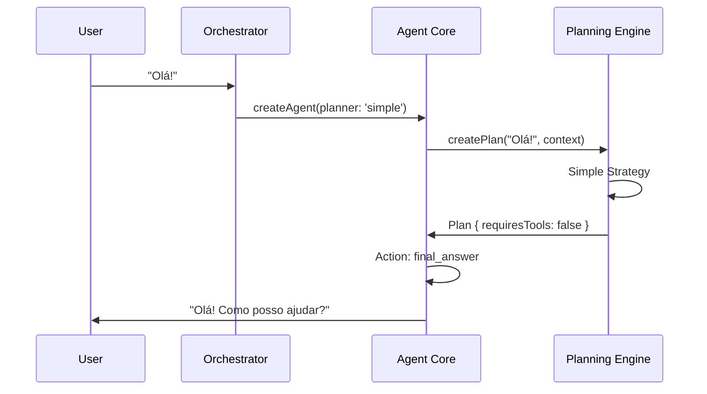
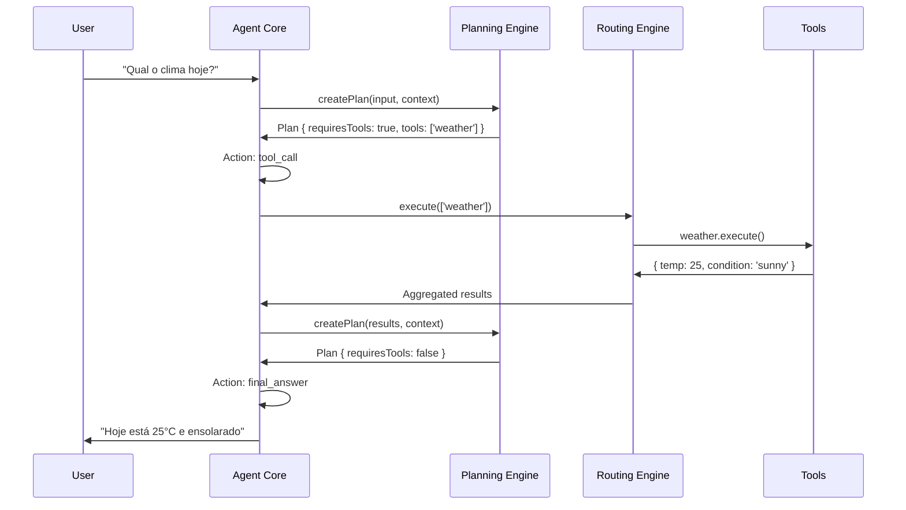
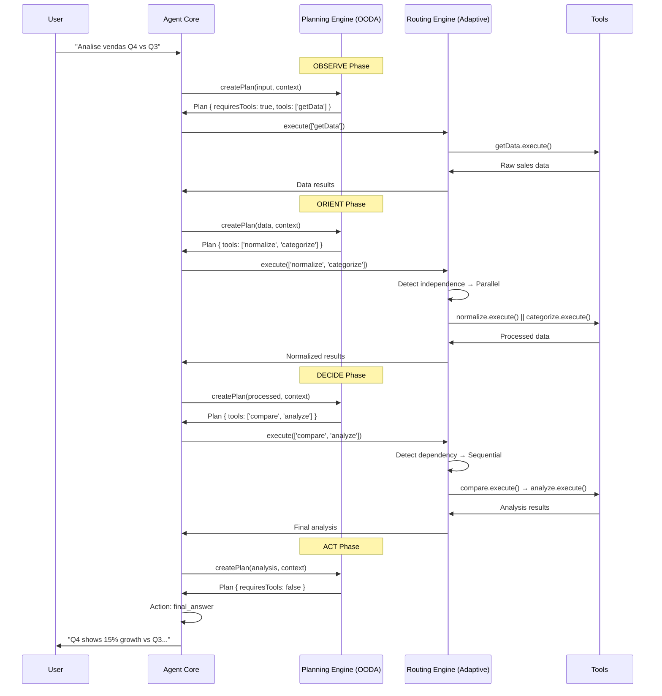

# Kodus Flow: Fluxograma Detalhado de Execução

## 🔄 Visão Geral do Fluxo



## 📋 Fluxo Detalhado por Camada

### 1. 🎯 ORCHESTRATOR (Coordenação)
```typescript
// Responsabilidades:
✅ Resolver configuração de planner (simple, smart, llmOoda, etc.)
✅ Resolver configuração de router (parallel, sequential, adaptive)
✅ Injetar LLM adapter se configurado
✅ Criar AgentCore com configurações resolvidas
❌ NÃO implementa lógica de thinking
❌ NÃO decide tipos de action
```

**Input:** User request + Agent configuration
**Output:** Configured AgentCore instance

### 2. 🤖 AGENT CORE (Ciclo Principal)
```typescript
// Responsabilidades:
✅ Implementar ciclo Think → Act → Observe
✅ Gerenciar thinking loop (max iterations)
✅ Decidir tipo de action baseado no Plan
✅ Coordenar chamadas para Planning e Routing
✅ Processar observações de tools
❌ NÃO implementa estratégias de thinking
❌ NÃO executa tools diretamente
```

**Fluxo Interno:**
```
1. Receber input
2. Criar AgentContext
3. Chamar Planning Engine
4. Processar Plan retornado
5. Decidir action type:
   - final_answer: resposta direta
   - tool_call: chamar Routing Engine
   - delegate_to_agent: multi-agent flow
6. Se tool_call: processar resultado e decidir se continua
7. Loop até final_answer ou timeout
```

### 3. 🧠 PLANNING ENGINE (Estratégia de Pensamento)
```typescript
// Responsabilidades (baseado em Foundation Agents research):
✅ Usar prompt templates específicos por estratégia
✅ Gerar plan inicial via LLM prompting
✅ Refinar plans durante execução (adaptive)
✅ Aplicar estratégias de research: CoT, ReAct, OODA, ToT
✅ Integração com Memory systems (futuro)
❌ NÃO decide action types finais
❌ NÃO executa tools diretamente
```

#### Estratégias com Prompt Templates:

**Simple Planner (Chain of Thought):**
```typescript
systemPrompt: `You are a helpful assistant. Think step by step.
1. Analyze the request
2. Determine if you need tools or can answer directly
3. Provide your reasoning`

// Input → CoT Prompting → Linear Plan
// Focus: Quick decisions, chat-first
```

**ReAct Planner:**
```typescript
systemPrompt: `Use this format:
Thought: I need to think about what to do
Action: tool_name OR final_answer
Action Input: parameters
Observation: result

Continue until you reach Final Answer.`

// Input → ReAct Loop → Iterative Refinement
// Focus: Tool-heavy problem solving
```

**OODA Planner:**
```typescript
systemPrompt: `Use military decision framework:
OBSERVE: What information do I have?
ORIENT: What does this mean in context?
DECIDE: What's the best action?
ACT: Execute the decision

Cycle through OODA until objective complete.`

// Input → OODA Cycles → Strategic Planning
// Focus: Dynamic environments, complex decisions
```

**Tree of Thoughts Planner:**
```typescript
systemPrompt: `Generate multiple approaches:
1. Approach A: [detailed reasoning]
2. Approach B: [alternative reasoning]
3. Approach C: [creative reasoning]

Evaluate each approach and select best path.`

// Input → Multi-path Analysis → Best Path Selection
// Focus: Creative tasks, exploration
```

### 4. 🔀 ROUTING ENGINE (Execução de Tools)
```typescript
// Responsabilidades:
✅ Receber action type = tool_call
✅ Analisar dependencies entre tools
✅ Aplicar estratégia de execução
✅ Coordenar execução (parallel/sequential/adaptive)
✅ Agregar resultados
✅ Retornar observações para Agent Core
❌ NÃO é chamado para final_answer
❌ NÃO define se vai usar tools
```

#### Estratégias de Routing:

**Sequential Router:**
```
Tools: [A, B, C] → A.execute() → B.execute() → C.execute()
- Máxima confiabilidade
- Resultados passados entre tools
```

**Parallel Router:**
```
Tools: [A, B, C] → Promise.all([A.execute(), B.execute(), C.execute()])
- Máxima velocidade
- Tools independentes
```

**Adaptive Router:**
```
Tools: [A, B, C] → Análise de Dependencies → Otimização Automática
- Parallel para independentes: A || B
- Sequential para dependentes: C após A,B
```

## 🎯 Cenários de Execução

### Cenário 1: Chat Simples (Sem Tools)


### Cenário 2: Tool Usage (Com Routing)


### Cenário 3: Multi-step Complex (OODA + Adaptive)


## 🔧 Responsabilidades por Componente

| Componente | O que FAZ | O que NÃO faz |
|------------|-----------|---------------|
| **Orchestrator** | Coordena, resolve configs, injeta deps | Thinking logic, action decisions |
| **Agent Core** | Ciclo Think→Act→Observe, decide actions | Planning strategies, tool execution |
| **Planning Engine** | Define HOW to think, generates plans | Action types, tool routing |
| **Routing Engine** | Executes tools efficiently | Planning, final answers |

## 🎨 Flexibilidade da Arquitetura

### Combinações Populares:

**Desenvolvimento/Prototipagem:**
```typescript
planner: 'simple'    // Rápido e direto
router: 'sequential' // Confiável e debuggável
```

**Produção Geral:**
```typescript
planner: 'smart'     // Auto-adapta
router: 'adaptive'   // Otimiza automaticamente
```

**Alta Performance:**
```typescript
planner: 'fast'      // Mínimo overhead
router: 'parallel'   // Máxima velocidade
```

**Casos Críticos:**
```typescript
planner: 'comprehensive' // Máxima qualidade
router: 'smart'         // Context-aware
```

## 🎯 Foco Atual: Implementação Básica

### **Prioridade 1: Fundação Sólida**

1. **Simple Planner com Prompt Template**
   ```typescript
   // Implementar prompt CoT básico
   // LLM decide: chat direto OU tool usage
   // Sem refinement por ora (plan estático)
   ```

2. **Agent Core chama Planning Engine** 
   ```typescript
   // Agent Core → Planning Engine → Plan
   // Agent Core decide action baseado no Plan
   // Ciclo Think→Act→Observe funcional
   ```

3. **LLM Integration Real**
   ```typescript
   // Planning Engine usa LLM via prompt templates
   // Não lógica hardcoded de requiresTools
   // LLM decide baseado no context
   ```

### **Próximas Iterações:**

4. **Plan Refinement** (adaptive planners)
5. **Memory Integration** (short/long term)
6. **Multi-modal Planning** (images, structured data)
7. **Advanced Prompt Engineering** (few-shot examples)

### **Research Foundation Validada:**

✅ Prompt templates por estratégia (ReAct, OODA, ToT)  
✅ LLM-driven decision making vs hardcoded logic  
✅ Plan refinement durante execução  
✅ Foundation Agents research integration  

**Começamos com Simple Planner + LLM prompting básico!**